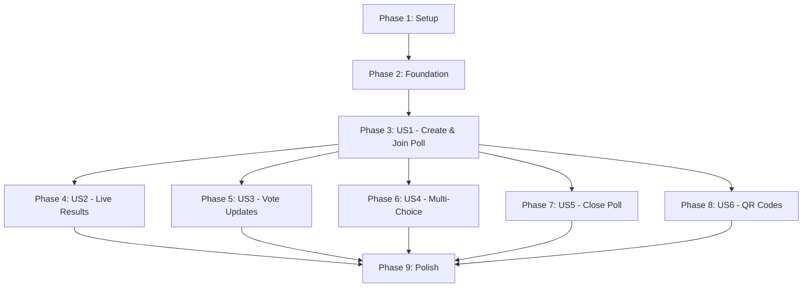

# Tasks: PollPoll - Conference Polling App

**Feature Branch**: `001-pulsepoll-app`  
**Input**: Design documents from `specs/001-pulsepoll-app/`  
**Prerequisites**: [plan.md](plan.md), [spec.md](spec.md), [data-model.md](data-model.md), [contracts/api-endpoints.md](contracts/api-endpoints.md), [research.md](research.md)

## Format: `- [ ] [ID] [P?] [Story] Description`

- **[P]**: Can run in parallel (different files, no dependencies)
- **[Story]**: User story this task belongs to (US1-US6)
- All tasks include exact file paths

---

## Phase 1: Setup (Shared Infrastructure)

**Purpose**: Project initialization and ASP.NET Core structure

- [X] T001 Create ASP.NET Core 10 web application project `PollPoll/PollPoll.csproj` with .NET 10 SDK
- [X] T002 Add NuGet packages: Microsoft.EntityFrameworkCore.Sqlite, Microsoft.AspNetCore.SignalR.Client, QRCoder, xUnit, FluentAssertions, Moq
- [X] T003 [P] Configure .editorconfig with .NET coding conventions and StyleCop analyzers
- [ ] T004 [P] Setup xUnit test project `PollPoll.Tests/PollPoll.Tests.csproj` with coverage reporting (Coverlet)
- [X] T005 [P] Configure appsettings.json and appsettings.Development.json with SQLite connection string and host token
- [X] T006 Create project folder structure: Models/, Data/, Services/, Controllers/, Pages/, Hubs/, Middleware/, wwwroot/
- [ ] T007 [P] Add Bootstrap 5 CSS/JS to wwwroot/lib/ and create base layout in Pages/Shared/_Layout.cshtml

---

## Phase 2: Foundational (Blocking Prerequisites)

**Purpose**: Core infrastructure required before ANY user story implementation

**⚠️ CRITICAL**: No user story work can begin until this phase is complete

- [X] T008 Create Poll entity in PollPoll/Models/Poll.cs with properties (Id, Code, Question, ChoiceMode, IsClosed, CreatedAt, ClosedAt)
- [X] T009 [P] Create Option entity in PollPoll/Models/Option.cs with properties (Id, PollId, Text, DisplayOrder)
- [X] T010 [P] Create Vote entity in PollPoll/Models/Vote.cs with properties (Id, PollId, OptionId, VoterId, SubmittedAt)
- [X] T011 Create PollDbContext in PollPoll/Data/PollDbContext.cs with DbSet<Poll>, DbSet<Option>, DbSet<Vote>, and configure relationships
- [X] T012 Configure indexes in PollDbContext.OnModelCreating: unique index on Poll.Code, index on Vote.VoterId, index on Vote.OptionId
- [X] T013 Create initial EF Core migration `dotnet ef migrations add InitialCreate` and apply to SQLite database
- [X] T014 [P] Create HostAuthMiddleware in PollPoll/Middleware/HostAuthMiddleware.cs to validate X-Host-Token header or HostAuth cookie
- [X] T015 [P] Configure middleware pipeline in Program.cs: exception handler, static files, routing, authentication, SignalR, endpoints
- [X] T016 Create global error handler in PollPoll/Middleware/ExceptionHandlerMiddleware.cs with user-friendly error messages (per Constitution UX)
- [X] T017 Configure Serilog or built-in logging in Program.cs for request/response logging and performance monitoring

**Checkpoint**: Foundation ready - user story implementation can now begin in parallel ✅

---

## Phase 3: User Story 1 - Create and Join Poll (Priority: P1) 🎯 MVP

**Goal**: Host creates poll with join code, participant joins and votes from phone

**Independent Test**: Create poll via host dashboard → receive join code → navigate to /p/{code} on phone → submit vote → see confirmation

### Tests for User Story 1 (TDD - RED Phase First)

- [X] T018 [P] [US1] Unit test for PollService.CreatePoll in PollPoll.Tests/Unit/PollServiceTests.cs (code generation, auto-close previous poll)
- [X] T019 [P] [US1] Unit test for VoteService.SubmitVote in PollPoll.Tests/Unit/VoteServiceTests.cs (duplicate prevention, voter ID tracking)
- [X] T020 [P] [US1] Contract test for POST /host/polls in PollPoll.Tests/Contract/HostApiTests.cs (request validation, response schema)
- [X] T021 [P] [US1] Contract test for POST /p/{code}/vote in PollPoll.Tests/Contract/VotingApiTests.cs (vote submission, cookie handling)
- [X] T022 [P] [US1] Integration test for end-to-end poll creation and voting in PollPoll.Tests/Integration/PollCreationFlowTests.cs
- [X] T023 [US1] Verify all User Story 1 tests FAIL (Red phase) - do not proceed until confirmed

### Implementation for User Story 1

- [X] T024 [US1] Implement PollService.CreatePoll in PollPoll/Services/PollService.cs (generate 4-char code, auto-close previous poll, save to DB)
- [X] T025 [P] [US1] Implement code generation logic in PollService with uniqueness check (loop until unique code found)
- [X] T026 [P] [US1] Implement VoteService.GetOrCreateVoterId in PollPoll/Services/VoteService.cs (GUID cookie management)
- [X] T027 [US1] Implement VoteService.SubmitVote in PollPoll/Services/VoteService.cs (check for existing vote, delete old + insert new in transaction)
- [X] T028 [US1] Create HostController.CreatePoll (POST /host/polls) in PollPoll/Controllers/HostController.cs with request validation and model binding
- [X] T029 [P] [US1] Create Razor Page Vote.cshtml/Vote.cshtml.cs in PollPoll/Pages/ for GET /p/{code} (display poll question, options as radio buttons)
- [X] T030 [US1] Implement POST handler in Vote.cshtml.cs for vote submission (call VoteService, set voter cookie, redirect to confirmation)
- [X] T031 [P] [US1] Add validation in HostController.CreatePoll: 2-6 options, question max 500 chars, option text max 200 chars
- [X] T032 [P] [US1] Add mobile-responsive CSS in wwwroot/css/site.css for voting page (large touch targets, readable fonts)
- [X] T033 [US1] Add error handling in Vote.cshtml.cs for poll not found (404 with actionable message "Poll not found. Check the code and try again")
- [X] T034 [US1] Verify all User Story 1 tests PASS (Green phase)
- [X] T035 [US1] Refactor PollService and VoteService for code quality (extract methods, add XML comments, DRY violations)

**US1 Complete**: Host can create poll, participant can join and vote ✅

---

## Phase 4: User Story 2 - Live Results Display (Priority: P2)

**Goal**: Results page shows live vote counts/percentages, updates automatically via SignalR

**Independent Test**: Open /p/{code}/results on projector → participants vote from phones → results update in real-time without refresh

### Tests for User Story 2 (TDD - RED Phase First)

- [ ] T036 [P] [US2] Unit test for ResultsService.GetPollResults in PollPoll.Tests/Unit/ResultsServiceTests.cs (vote count aggregation, percentage calculation)
- [ ] T037 [P] [US2] Contract test for GET /api/results/{code} in PollPoll.Tests/Contract/ResultsApiTests.cs (JSON response schema)
- [ ] T038 [P] [US2] Integration test for SignalR ResultsHub in PollPoll.Tests/Integration/SignalRTests.cs (vote broadcast to connected clients)
- [ ] T039 [US2] Verify all User Story 2 tests FAIL (Red phase)

### Implementation for User Story 2

- [ ] T040 [US2] Create ResultsService in PollPoll/Services/ResultsService.cs with GetPollResults method (LINQ aggregation: COUNT, GROUP BY)
- [ ] T041 [P] [US2] Create ResultsHub in PollPoll/Hubs/ResultsHub.cs with JoinPollGroup and VoteUpdated methods
- [ ] T042 [P] [US2] Create Razor Page Results.cshtml/Results.cshtml.cs in PollPoll/Pages/ for GET /p/{code}/results (display vote table, include SignalR client script)
- [ ] T043 [US2] Add SignalR JavaScript client to Results.cshtml (connect to hub, join poll group, update DOM on VoteUpdated event)
- [ ] T044 [US2] Modify VoteService.SubmitVote to broadcast to ResultsHub after vote save (inject IHubContext<ResultsHub>)
- [ ] T045 [P] [US2] Add projection-optimized CSS in wwwroot/css/results.css (min 24px fonts, high contrast, large vote counts)
- [ ] T046 [P] [US2] Implement fallback polling in Results.cshtml (setInterval every 5s if SignalR connection fails)
- [ ] T047 [P] [US2] Add throttling to ResultsHub broadcasts (max 1 update/second, batch rapid votes per PERF-009)
- [ ] T048 [US2] Display total vote count prominently on results page (per FR-018)
- [ ] T049 [US2] Add loading spinner for initial results load (>500ms per UX-003)
- [ ] T050 [US2] Verify all User Story 2 tests PASS (Green phase)
- [ ] T051 [US2] Refactor ResultsService and ResultsHub (code quality review)

**US2 Complete**: Results display live with SignalR real-time updates ✅

---

## Phase 5: User Story 3 - Vote Update and Duplicate Prevention (Priority: P3)

**Goal**: Participants can change votes, system prevents duplicates via voter ID tracking

**Independent Test**: Vote "Blue" → refresh page → see "Blue" selected → change to "Red" → submit → results show only "Red" vote (no duplicate)

### Tests for User Story 3 (TDD - RED Phase First)

- [ ] T052 [P] [US3] Unit test for VoteService duplicate prevention in PollPoll.Tests/Unit/VoteServiceTests.cs (vote update replaces, not adds)
- [ ] T053 [P] [US3] Integration test for vote update flow in PollPoll.Tests/Integration/VoteUpdateTests.cs (submit vote, change vote, verify single vote)
- [ ] T054 [US3] Verify all User Story 3 tests FAIL (Red phase)

### Implementation for User Story 3

- [ ] T055 [US3] Enhance VoteService.SubmitVote to query existing votes by VoterId before insert (delete in same transaction)
- [ ] T056 [P] [US3] Modify Vote.cshtml.cs OnGet to pre-select voter's previous vote (query Vote by VoterId, set selected option)
- [ ] T057 [P] [US3] Add voter feedback on Vote.cshtml when changing vote ("Your previous vote will be updated")
- [ ] T058 [US3] Verify vote count accuracy in integration test (100 participants voting, some changing votes, final count correct)
- [ ] T059 [US3] Verify all User Story 3 tests PASS (Green phase)
- [ ] T060 [US3] Refactor vote update logic for clarity

**US3 Complete**: Vote updates work correctly, no duplicates ✅

---

## Phase 6: User Story 4 - Multi-Choice Polls (Priority: P4)

**Goal**: Host creates multi-choice polls, participants select multiple options (checkboxes)

**Independent Test**: Create poll with ChoiceMode=Multi → participant sees checkboxes → selects 3 options → submit → results show all 3 votes

### Tests for User Story 4 (TDD - RED Phase First)

- [ ] T061 [P] [US4] Unit test for PollService multi-choice creation in PollPoll.Tests/Unit/PollServiceTests.cs (ChoiceMode enum)
- [ ] T062 [P] [US4] Unit test for VoteService multi-vote submission in PollPoll.Tests/Unit/VoteServiceTests.cs (multiple votes per voter)
- [ ] T063 [P] [US4] Integration test for multi-choice voting flow in PollPoll.Tests/Integration/MultiChoiceTests.cs
- [ ] T064 [US4] Verify all User Story 4 tests FAIL (Red phase)

### Implementation for User Story 4

- [ ] T065 [US4] Add ChoiceMode dropdown to host poll creation form in HostController view (Single vs Multi)
- [ ] T066 [P] [US4] Modify Vote.cshtml to render checkboxes when poll.ChoiceMode == Multi, radio buttons when Single
- [ ] T067 [US4] Update VoteService.SubmitVote to accept array of OptionIds (delete all existing votes, insert multiple)
- [ ] T068 [P] [US4] Update Vote.cshtml.cs POST handler to bind multiple selectedOptionIds from checkbox form data
- [ ] T069 [P] [US4] Add validation in Vote.cshtml.cs: single-choice must have exactly 1 selection, multi-choice min 1 selection
- [ ] T070 [P] [US4] Update Results.cshtml to handle total votes > participant count (multi-choice scenario)
- [ ] T071 [US4] Verify all User Story 4 tests PASS (Green phase)
- [ ] T072 [US4] Refactor choice mode logic

**US4 Complete**: Multi-choice polls fully functional ✅

---

## Phase 7: User Story 5 - Close Poll and Results Persistence (Priority: P5)

**Goal**: Host closes poll to stop votes, results remain accessible, creating new poll auto-closes previous

**Independent Test**: Create poll → close poll → attempt to vote (blocked) → view results (accessible) → create new poll (previous auto-closed)

### Tests for User Story 5 (TDD - RED Phase First)

- [ ] T073 [P] [US5] Unit test for PollService.ClosePoll in PollPoll.Tests/Unit/PollServiceTests.cs (set IsClosed, ClosedAt)
- [ ] T074 [P] [US5] Unit test for PollService auto-close logic in CreatePoll method
- [ ] T075 [P] [US5] Integration test for closed poll voting block in PollPoll.Tests/Integration/ClosedPollTests.cs
- [ ] T076 [US5] Verify all User Story 5 tests FAIL (Red phase)

### Implementation for User Story 5

- [ ] T077 [US5] Implement PollService.ClosePoll in PollPoll/Services/PollService.cs (set IsClosed = true, ClosedAt = DateTime.UtcNow)
- [ ] T078 [P] [US5] Update PollService.CreatePoll to query open poll, call ClosePoll before creating new poll
- [ ] T079 [US5] Add validation in VoteService.SubmitVote to check poll.IsClosed, return error if true
- [ ] T080 [P] [US5] Update Vote.cshtml to display "Poll closed" message and disable voting form when IsClosed == true
- [ ] T081 [P] [US5] Add "CLOSED" status badge to Results.cshtml when poll is closed
- [ ] T082 [P] [US5] Create host dashboard page in HostController.Index (GET /host/polls) listing all polls with codes, questions, status
- [ ] T083 [P] [US5] Add manual close button to host dashboard (optional, per spec auto-close on new poll is primary)
- [ ] T084 [US5] Verify all User Story 5 tests PASS (Green phase)
- [ ] T085 [US5] Refactor poll lifecycle management

**US5 Complete**: Poll closing and auto-close on new poll creation works ✅

---

## Phase 8: User Story 6 - QR Code Generation (Priority: P6)

**Goal**: Host receives QR code for poll join URL, scannable from across room

**Independent Test**: Create poll → see QR code on host dashboard → scan with phone camera → navigates to /p/{code}

### Tests for User Story 6 (TDD - RED Phase First)

- [ ] T086 [P] [US6] Unit test for QRCodeService.GenerateQRCode in PollPoll.Tests/Unit/QRCodeServiceTests.cs (Base64 PNG output)
- [ ] T087 [P] [US6] Contract test for GET /host/polls/{code}/qr in PollPoll.Tests/Contract/QRCodeApiTests.cs
- [ ] T088 [US6] Verify all User Story 6 tests FAIL (Red phase)

### Implementation for User Story 6

- [ ] T089 [US6] Install QRCoder NuGet package to PollPoll.csproj
- [ ] T090 [P] [US6] Create QRCodeService in PollPoll/Services/QRCodeService.cs with GenerateQRCode method (use QRCoder library)
- [ ] T091 [US6] Update PollService.CreatePoll to call QRCodeService and include qrCodeDataUrl in response
- [ ] T092 [P] [US6] Add GET /host/polls/{code}/qr endpoint in HostController for QR regeneration (per contract spec)
- [ ] T093 [P] [US6] Display QR code image in host dashboard and poll detail view (minimum 200x200px per UX-009)
- [ ] T094 [P] [US6] Cache generated QR codes in memory (IMemoryCache) to avoid regeneration (per PERF-008)
- [ ] T095 [P] [US6] Add absolute URL generation logic in QRCodeService (use HttpContext.Request to get Codespaces public URL)
- [ ] T096 [US6] Verify all User Story 6 tests PASS (Green phase)
- [ ] T097 [US6] Refactor QR code generation and caching

**US6 Complete**: QR codes generated and displayed ✅

---

## Phase 9: Polish & Cross-Cutting Concerns

**Purpose**: Finalize accessibility, performance, error handling, constitutional compliance

- [ ] T098 [P] Add WCAG 2.1 AA accessibility features: ARIA labels for form inputs, keyboard navigation for all actions, 4.5:1 color contrast
- [ ] T099 [P] Add loading states (spinners) to all >500ms operations: poll creation, vote submission, results load (per UX-003)
- [ ] T100 [P] Implement performance monitoring: log request durations, add metrics for PERF-001 through PERF-010 validation
- [ ] T101 [P] Add database query optimization: verify indexes are used (check SQLite EXPLAIN QUERY PLAN for Poll.Code lookups)
- [ ] T102 [P] Add comprehensive error messages for all edge cases: invalid poll codes, validation failures, closed polls (per UX-002)
- [ ] T103 [P] Create README.md with quickstart instructions referencing specs/001-pulsepoll-app/quickstart.md
- [ ] T104 [P] Add . ontainer configuration for GitHub Codespaces (forward port 5000, install .NET 10 SDK)
- [ ] T105 Conduct accessibility manual audit: test keyboard navigation, screen reader (NVDA/JAWS), color contrast with validator
- [ ] T106 Run load test with k6: simulate 100 concurrent voters, verify PERF-007 (no degradation)
- [ ] T107 Run performance benchmarks: verify poll creation <500ms, vote submission <300ms p95, results load <2s (PERF-001, PERF-002, PERF-003)
- [ ] T108 Final code review: verify all constitutional principles met (StyleCop clean, 80% coverage, UX actionable errors, performance targets)

**Polish Complete**: Production-ready for conference demo ✅

---

## Dependencies & Execution Order

### User Story Completion Sequence

**Critical Path**:
1. Setup (Phase 1) → Foundation (Phase 2) → US1 (Phase 3) → US2 (Phase 4) → Polish (Phase 9)

**Parallelizable After US1**:
- US3 (Vote Updates) can be developed independently
- US4 (Multi-Choice) can be developed independently
- US5 (Close Poll) can be developed independently
- US6 (QR Codes) can be developed independently

### Parallel Execution Examples

**After Phase 2 Complete (Foundation)**:
- US1 tests can be written in parallel with US1 implementation models (different files)
- PollService and VoteService can be developed in parallel (different concerns)

**After Phase 3 Complete (US1 MVP)**:
- Team Member A: Work on US2 (SignalR ResultsHub)
- Team Member B: Work on US4 (Multi-Choice checkbox UI)
- Team Member C: Work on US6 (QR Code generation)
- All three can proceed independently without conflicts

**Within Each Phase**:
- Tests marked [P] can run simultaneously (different test files)
- Implementation tasks marked [P] modify different files

---

## Implementation Strategy

### MVP Scope (Minimal Viable Product)
**Recommended First Delivery**: Phase 1 + Phase 2 + Phase 3 (US1 only)

This delivers:
- Host can create polls
- Participants can join and vote
- Basic duplicate prevention
- Core value proposition proven

**Estimated effort**: ~40% of total tasks (T001-T035)

### Incremental Delivery Plan
1. **Sprint 1**: Setup + Foundation + US1 (T001-T035) → Demo basic polling
2. **Sprint 2**: US2 + US5 (T036-T051, T073-T085) → Add live results + poll lifecycle
3. **Sprint 3**: US3 + US4 + US6 (T052-T072, T086-T097) → Add vote updates, multi-choice, QR codes
4. **Sprint 4**: Polish (T098-T108) → Performance tuning, accessibility, final review

### Task Validation Checklist

Each task must:
- ✅ Have unique sequential ID (T001, T002, etc.)
- ✅ Include exact file path in description
- ✅ Be independently testable (acceptance criteria clear)
- ✅ Follow TDD workflow: Tests before implementation within each user story
- ✅ Mark parallelizable tasks with [P]
- ✅ Include user story label [US1]-[US6] for story-specific tasks
- ✅ Reference constitutional principles where applicable (code quality, testing, UX, performance)

---

## Summary

**Total Tasks**: 108  
**Parallelizable Tasks**: 62 (marked with [P])  
**User Stories**: 6 (P1-P6 priority)  
**Phases**: 9 (Setup, Foundation, 6 User Story Phases, Polish)

**Task Distribution by Phase**:
- Phase 1 (Setup): 7 tasks
- Phase 2 (Foundation): 10 tasks
- Phase 3 (US1 - MVP): 18 tasks
- Phase 4 (US2): 16 tasks
- Phase 5 (US3): 9 tasks
- Phase 6 (US4): 12 tasks
- Phase 7 (US5): 13 tasks
- Phase 8 (US6): 12 tasks
- Phase 9 (Polish): 11 tasks

**Independent Test Criteria**:
- US1: Create poll → join → vote → confirmation (works standalone)
- US2: Results page updates in real-time when votes submitted
- US3: Change vote → see update reflected, no duplicates
- US4: Select multiple checkboxes → submit → all counted
- US5: Closed poll blocks voting, results accessible
- US6: Scan QR code → navigates to poll

**Parallel Opportunities**:
- After Foundation: All 6 user stories can be developed by different team members
- Within each story: Tests and models can be created simultaneously
- Polish phase: All 11 tasks are independent (accessibility, performance, docs)

**Format Validation**: ✅ ALL tasks follow required checkbox format with task ID, [P] markers, [Story] labels, and file paths
